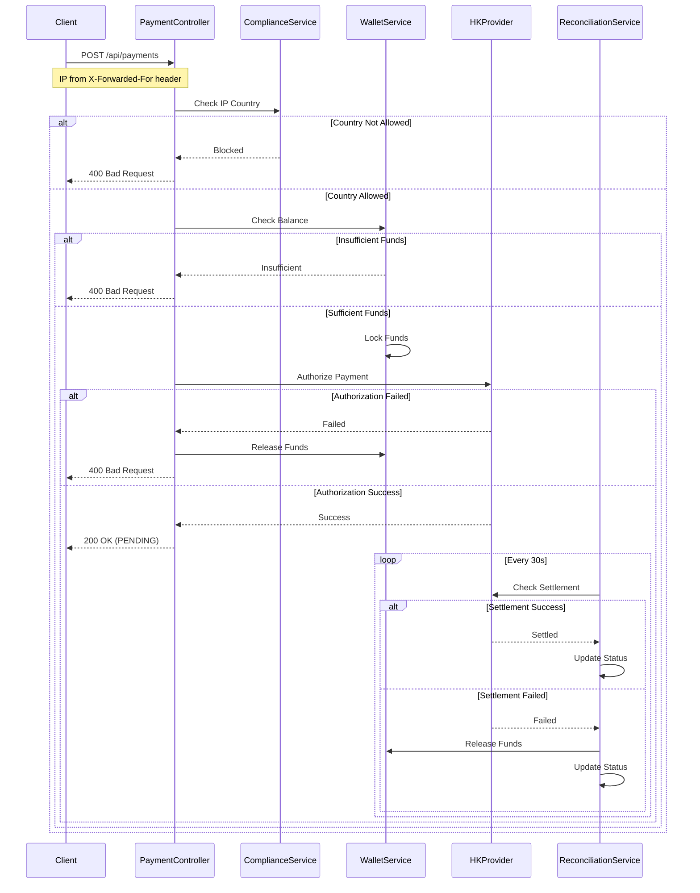
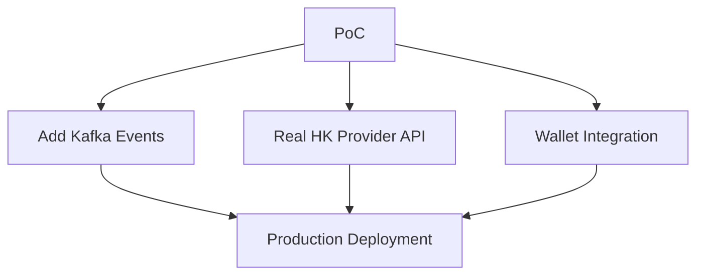

# Virtual Card Payment PoC

## Overview
Spring Boot application demonstrating virtual card payment system with IP-based compliance checks and async settlement.

## Payment Process Flow



### Key Process Steps

1. **Compliance Check**
   - Validates user's IP address from request headers
   - Supports multiple proxy headers (X-Forwarded-For, Proxy-Client-IP, etc.)
   - Currently supports Vietnam, South Korea, Japan, Kazakhstan, and Kyrgyzstan
   - Logs compliance events for audit purposes

2. **Balance Verification**
   - Checks user's USDC wallet balance
   - Ensures sufficient funds before proceeding
   - Locks funds to prevent double-spending

3. **Payment Authorization**
   - Integrates with Hong Kong card provider
   - Maximum transaction limit of $1000
   - Simulates network latency (200ms)

4. **Reconciliation**
   - Runs every 30 seconds
   - Checks pending transactions
   - Updates status to SETTLED or FAILED
   - Releases funds on failure

### Transaction States

- **NEW**: Initial state when transaction is created
- **PENDING**: Payment authorized, waiting for settlement
- **SETTLED**: Payment successfully completed
- **FAILED**: Payment failed, funds released

## Architecture

```
src/main/java/com/payment/poc/
├── controller/
│   └── PaymentController.java       # Main payment endpoints
├── service/
│   ├── WalletService.java          # Unified wallet interface
│   ├── CustodialWallet.java        # Mock custodial implementation  
│   ├── ComplianceService.java      # Geo-blocking for Asian markets
│   ├── HongKongProviderService.java # Mock card provider
│   └── ReconciliationService.java  # Automated settlement
├── model/
│   ├── Transaction.java            # JPA entity
│   ├── TransactionStatus.java      # State enum
│   └── PaymentRequest.java         # Request DTO
└── VirtualCardPaymentApplication.java
```

## Key Demos

### 1. Vietnam User Success
```bash
curl -X POST http://localhost:8080/api/payments \
  -H "Content-Type: application/json" \
  -H "X-Forwarded-For: 203.113.123.45" \
  -d '{
    "userId": "USER123",
    "amount": 100.00
  }'
```

### 2. EU User Geo-Blocked
```bash
curl -X POST http://localhost:8080/api/payments \
  -H "Content-Type: application/json" \
  -H "X-Forwarded-For: 91.185.123.45" \
  -d '{
    "userId": "USER123", 
    "amount": 50.00
  }'
```

### 3. Check Transaction Status
```bash
curl http://localhost:8080/api/payments/1
```

### 4. View All Transactions  
```bash
curl http://localhost:8080/api/payments
```

### 5. Check User Balance
```bash
curl http://localhost:8080/api/payments/balance/USER123
```

## Running the Application

```bash
# Build and run
./gradlew bootRun

# Application starts on http://localhost:8080
# H2 Console available at http://localhost:8080/h2-console
```

## Business Value Demonstration

| Component | Business Impact | Key Benefits |
|-----------|-----------------|-------------------|
| Unified Wallet Interface | Smooth custodial→non-custodial migration | Reduced technical debt |
| Geo-Rules | 2x faster market entry | Simplified regulatory compliance |
| Reconciliation Service | 30% faster dispute resolution | Improved settlement flows |
| Transaction State Management | Fewer failed transactions | Better async payment handling |

## Technical Discussion Points

### Technical Architecture
- **Wallet Abstraction:** How would this interface help migrate to non-custodial wallets?
- **Circuit Breakers:** Where would you add resilience patterns for HK provider API?
- **Monitoring:** What metrics would you track for reconciliation efficiency?

### Business Alignment  
- **Market Focus:** How does this accelerate Southeast Asian expansion?
- **Settlement Costs:** What's the business impact of 1% reconciliation failure rate?
- **Compliance:** How would you extend this for other Asian markets (Korea, Japan)?

### Production Readiness
- **Kafka Integration:** Replace @Scheduled with event-driven reconciliation
- **Security:** Add audit trails for compliance
- **Scaling:** How would you handle 10K+ concurrent transactions?

## Key Features

### ✅ State Management
- NEW → PENDING → SETTLED/FAILED flow
- Automatic timeout handling (2 hours)
- Fund locking/release on failures

### ✅ Compliance Engine
- IP-based geo-blocking
- Configurable country rules
- Audit logging for regulators

### 🔒 Production-Grade IP Validation

#### Network-Level Controls
1. **API Gateway IP Filtering**
   - Allowlist/denylist IP ranges using CIDR blocks
   - Block transactions from high-risk regions
   - Terraform-managed security groups

2. **Reverse Proxy Configuration**
   - Validate `X-Forwarded-For` headers
   - Whitelist trusted proxy IPs (Cloudflare, load balancers)
   - Prevent IP spoofing

#### Application-Layer Validation
3. **Real-Time IP Reputation**
   - Integration with SEON/MaxMind for:
     - Geolocation-based risk scoring
     - VPN/Tor node detection
     - ASN validation for data center IPs
   - Redis-cached results for performance

4. **Velocity Monitoring**
   - Track IP transaction frequency
   - Auto-block suspicious IPs
   - Trigger manual reviews

#### Fraud Detection Integration
5. **Multi-Factor Risk Scoring**
   - Device fingerprinting
   - Behavioral biometrics
   - Historical user patterns

6. **Payment Processor Rules**
   - Billing/IP geolocation matching
   - Proxy/VPN detection
   - IP reputation checks

#### Compliance Safeguards
7. **OFAC/Sanctions Screening**
   - Cross-reference against sanctioned regions
   - Comprehensive audit logging
   - Compliance reporting

8. **PCI DSS Alignment**
   - IP tokenization
   - Secure logging practices
   - Data masking

#### Technical Implementation

##### Architecture Recommendations
| Layer          | Tools/Techniques                          | Use Case                          |
|----------------|-------------------------------------------|-----------------------------------|
| Network        | AWS Security Groups, Terraform            | Allowlisting payment processor IPs |
| Application    | Spring Boot ModHeaderFilter, Redis        | IP velocity checks                |
| Observability  | Grafana/Prometheus, Elasticsearch         | Geo-distribution dashboards       |

##### Implementation Checklist
- Use `HttpServletRequest` with header validation for accurate client IP detection
- Deploy rate limiting (100 requests/IP/minute) at the API gateway
- Conduct quarterly penetration tests focusing on IP spoofing vulnerabilities

##### Example: Redis-based Velocity Check
```java
@Service
public class IpVelocityService {
    private final RedisTemplate<String, Integer> redisTemplate;
    
    public boolean checkVelocity(String ip) {
        String key = "txn_count:" + ip;
        Long current = redisTemplate.opsForValue().increment(key);
        if (current > 10) { // Threshold
            blockIp(ip);
            return false;
        }
        redisTemplate.expire(key, Duration.ofHours(1));
        return true;
    }
}
```

##### Example: IP Reputation Check
```java
@Service
public class IpReputationService {
    private final MaxMindGeoIp2Client geoIpClient;
    
    public RiskScore checkIpReputation(String ip) {
        GeoIp2Response response = geoIpClient.city(ip);
        return RiskScore.builder()
            .isVpn(response.isVpn())
            .isTorExit(response.isTorExit())
            .isDataCenter(response.isDataCenter())
            .countryCode(response.getCountry().getIsoCode())
            .build();
    }
}
```

### ✅ Wallet Abstraction
- Interface ready for non-custodial migration
- Mock custodial implementation
- Balance and fund management

### ✅ Reconciliation
- Scheduled settlement checks (30s intervals)
- Automatic failure recovery
- HK provider integration simulation

## Future Enhancements

### Production Path


### Security Additions
- JWT authentication
- Rate limiting
- PCI-DSS compliance
- Encrypted transaction logs

### Monitoring
- Prometheus metrics
- Grafana dashboards  
- Alert manager integration
- Performance tracking

## IP Detection and Filtering Patterns

Robust IP detection and filtering are essential for controlling access to services, especially in regulated environments like fintech or virtual card payment systems. Below are key architectural and operational patterns for IP detection and enforcement.

### **1. Network-Level IP Filtering**

- **Firewall Rules & Security Groups:**  
  Use network firewalls or cloud security groups to allow or block traffic based on source IP addresses. This is the first line of defense and prevents unauthorized traffic from ever reaching your application.

- **API Gateway Filtering:**  
  Modern API gateways (e.g., Envoy, AWS API Gateway) support IP allowlists/denylists, which can be configured to check the original source IP before routing requests to backend services.  
  - Example: Envoy's `ClientTrafficPolicy` can extract the client IP from headers like `X-Forwarded-For`, considering trusted proxy hops.

### **2. Application-Layer IP Validation**

- **Middleware Checks:**  
  Implement IP validation logic within your application's middleware. This allows you to apply business-specific rules, such as only allowing certain endpoints to be accessed from specific IP ranges.

- **Header Parsing:**  
  For applications behind proxies or load balancers, extract the client IP from trusted headers (e.g., `X-Forwarded-For`). Ensure you only trust these headers if set by your infrastructure to prevent spoofing.

### **3. Pattern-Based and Dynamic Filtering**

- **Pattern Sets:**  
  Some platforms allow you to define pattern sets—collections of IPs or ranges to match against incoming requests. These can be updated dynamically and evaluated via custom expressions or policies.

- **Geolocation and Risk-Based Filtering:**  
  Enhance IP checks with geolocation or risk scoring (e.g., blocking high-risk countries or known bad actors). This is common in compliance-driven systems, where you may need to prevent access from sanctioned regions.

### **4. Allowlist and Denylist Strategies**

- **Allowlist (Whitelist):**  
  Only explicitly approved IPs/ranges can access the service. This is highly secure but requires careful management to avoid locking out legitimate users.

- **Denylist (Blacklist):**  
  Block known malicious or unwanted IPs, allowing all others. This is easier to manage but less secure, as new threats may arise from unlisted IPs.

- **Priority and Rule Management:**  
  Some systems allow you to set the priority of allowlist and denylist rules, ensuring, for example, that denylist entries always override allowlist ones if there's a conflict.

### **5. Monitoring and Maintenance**

- **Logging and Auditing:**  
  Log all denied or suspicious requests for compliance and forensic analysis. This is critical in regulated environments.

- **Regular Updates:**  
  Continuously monitor and update your IP lists and patterns based on new intelligence, business changes, or compliance requirements.

### **Example: Envoy Gateway IP Detection Pattern**

```yaml
apiVersion: gateway.envoyproxy.io/v1alpha1
kind: ClientTrafficPolicy
metadata:
  name: enable-client-ip-detection
spec:
  clientIPDetection:
    xForwardedFor:
      numTrustedHops: 1
  targetRefs:
    - group: gateway.networking.k8s.io
      kind: Gateway
      name: eg
```

### **Summary Table: IP Detection and Filtering Patterns**

| Pattern Type         | Description                                                       | Use Case                            |
|---------------------|-------------------------------------------------------------------|-------------------------------------|
| Firewall/Security Group | Blocks/permits traffic at the network edge                      | First line of defense               |
| API Gateway Filtering   | Enforces IP rules before requests reach backend services         | Centralized, scalable enforcement   |
| Application Middleware  | Business logic validation, dynamic rule application              | Fine-grained, endpoint-specific     |
| Pattern Sets            | Dynamic, expression-based matching of IPs/ranges                 | Easily updated, flexible policies   |
| Allowlist/Denylist      | Explicitly permit or block IPs; can be prioritized               | Compliance, high-security scenarios |
| Geolocation Filtering   | Block/allow based on country or risk profile                     | Regulatory compliance, fraud risk   |

**Best Practice:**  
Combine network-level filtering with application-layer checks and dynamic pattern management for defense-in-depth. Always ensure IP extraction is trustworthy, especially when using headers behind proxies. Regularly review and update your rules to adapt to evolving threats and compliance needs.

---

**Built with:** Java 21, Spring Boot 3.2, H2 Database, Gradle
