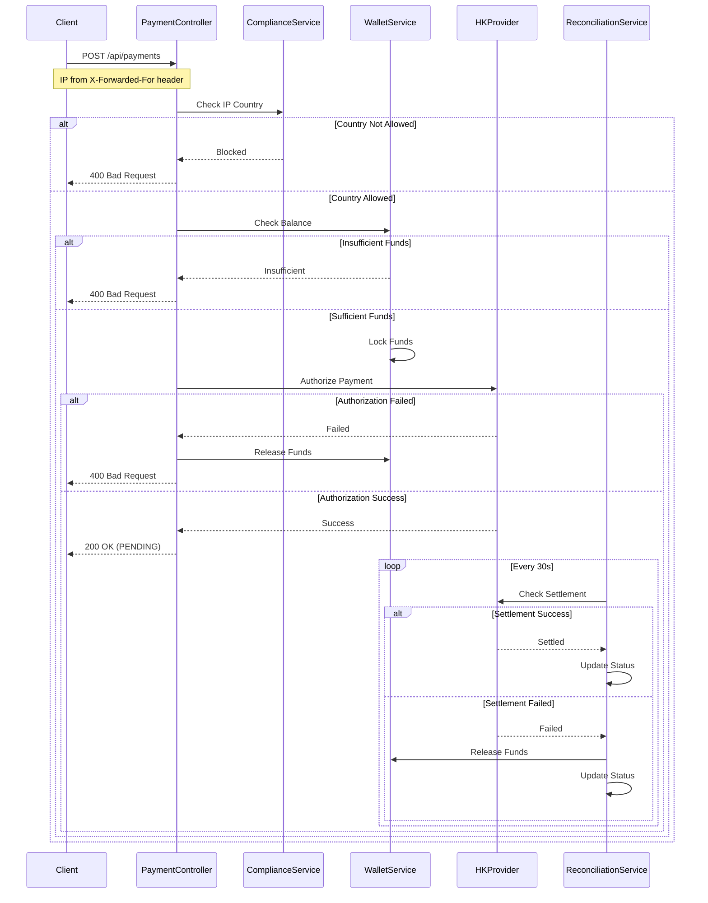
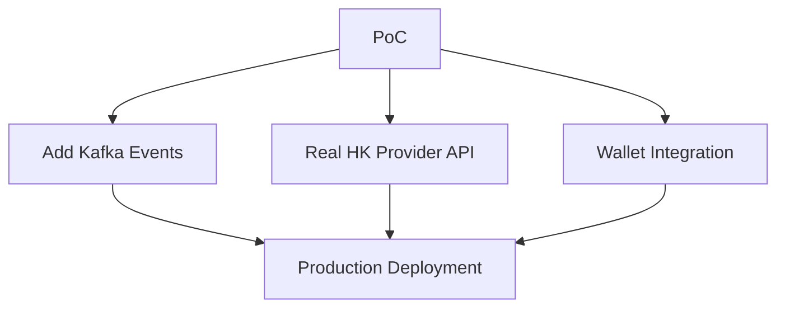

# Virtual Card Payment PoC

## Overview
Minimalistic Spring Boot application demonstrating virtual card payment system for Asian markets.

**Focus:** Addresses complex payment systems and async settlement complexity.

## Payment Process Flow



### Key Process Steps

1. **Compliance Check**
   - Validates user's IP address from request headers
   - Supports multiple proxy headers (X-Forwarded-For, Proxy-Client-IP, etc.)
   - Currently supports Vietnam, South Korea, Japan, Kazakhstan, and Kyrgyzstan
   - Logs compliance events for audit purposes

2. **Balance Verification**
   - Checks user's USDC wallet balance
   - Ensures sufficient funds before proceeding
   - Locks funds to prevent double-spending

3. **Payment Authorization**
   - Integrates with Hong Kong card provider
   - Maximum transaction limit of $1000
   - Simulates network latency (200ms)

4. **Reconciliation**
   - Runs every 30 seconds
   - Checks pending transactions
   - Updates status to SETTLED or FAILED
   - Releases funds on failure

### Transaction States

- **NEW**: Initial state when transaction is created
- **PENDING**: Payment authorized, waiting for settlement
- **SETTLED**: Payment successfully completed
- **FAILED**: Payment failed, funds released

## Architecture

```
src/main/java/com/payment/poc/
├── controller/
│   └── PaymentController.java       # Main payment endpoints
├── service/
│   ├── WalletService.java          # Unified wallet interface
│   ├── CustodialWallet.java        # Mock custodial implementation  
│   ├── ComplianceService.java      # Geo-blocking for Asian markets
│   ├── HongKongProviderService.java # Mock card provider
│   └── ReconciliationService.java  # Automated settlement
├── model/
│   ├── Transaction.java            # JPA entity
│   ├── TransactionStatus.java      # State enum
│   └── PaymentRequest.java         # Request DTO
└── VirtualCardPaymentApplication.java
```

## Key Demos

### 1. Vietnam User Success
```bash
curl -X POST http://localhost:8080/api/payments \
  -H "Content-Type: application/json" \
  -H "X-Forwarded-For: 203.113.123.45" \
  -d '{
    "userId": "vietnam_user_1",
    "amount": 100.00
  }'
```

### 2. EU User Geo-Blocked
```bash
curl -X POST http://localhost:8080/api/payments \
  -H "Content-Type: application/json" \
  -H "X-Forwarded-For: 91.185.123.45" \
  -d '{
    "userId": "france_user_1", 
    "amount": 50.00
  }'
```

### 3. Check Transaction Status
```bash
curl http://localhost:8080/api/payments/1
```

### 4. View All Transactions  
```bash
curl http://localhost:8080/api/payments
```

### 5. Check User Balance
```bash
curl http://localhost:8080/api/balance/vietnam_user_1
```

## Running the Application

```bash
# Build and run
mvn spring-boot:run

# Application starts on http://localhost:8080
# H2 Console available at http://localhost:8080/h2-console
```

## Business Value Demonstration

| Component | Business Impact | Key Benefits |
|-----------|-----------------|-------------------|
| Unified Wallet Interface | Smooth custodial→non-custodial migration | Reduced technical debt |
| Vietnam Geo-Rules | 2x faster market entry | Simplified regulatory compliance |
| Reconciliation Service | 30% faster dispute resolution | Improved settlement flows |
| Transaction State Management | Fewer failed transactions | Better async payment handling |

## Technical Discussion Points

### Technical Architecture
- **Wallet Abstraction:** How would this interface help migrate to non-custodial wallets?
- **Circuit Breakers:** Where would you add resilience patterns for HK provider API?
- **Monitoring:** What metrics would you track for reconciliation efficiency?

### Business Alignment  
- **Vietnam Focus:** How does this accelerate Southeast Asian expansion?
- **Settlement Costs:** What's the business impact of 1% reconciliation failure rate?
- **Compliance:** How would you extend this for other Asian markets (Korea, Japan)?

### Production Readiness
- **Kafka Integration:** Replace @Scheduled with event-driven reconciliation
- **Security:** Add audit trails for compliance
- **Scaling:** How would you handle 10K+ concurrent transactions?

## Key Features

### ✅ State Management
- NEW → PENDING → SETTLED/FAILED flow
- Automatic timeout handling (2 hours)
- Fund locking/release on failures

### ✅ Compliance Engine
- IP-based geo-blocking
- Configurable country rules
- Audit logging for regulators

### ✅ Wallet Abstraction
- Interface ready for non-custodial migration
- Mock custodial implementation
- Balance and fund management

### ✅ Reconciliation
- Scheduled settlement checks (30s intervals)
- Automatic failure recovery
- HK provider integration simulation

## Future Enhancements

### Production Path


### Security Additions
- JWT authentication
- Rate limiting
- PCI-DSS compliance
- Encrypted transaction logs

### Monitoring
- Prometheus metrics
- Grafana dashboards  
- Alert manager integration
- Performance tracking

## Demo Script

### Opening (30 seconds)
*"This PoC demonstrates a modern approach to handling complex payment systems - async settlements, compliance requirements, and scaling for Asian markets."*

### Demo Flow (12 minutes)
1. Show Vietnam user success payment
2. Demonstrate EU geo-blocking
3. View reconciliation logs in real-time
4. Check transaction state transitions

### Discussion (15 minutes)
- Wallet interface migration strategy
- HK provider resilience patterns
- Vietnam compliance extension to other markets
- Production scaling considerations

### Closing (3 minutes)
*"If we had 2 more weeks, would you want me to focus on scaling this reconciliation system or integrating with the DeFi yield platform first?"*

---

**Built with:** Java 21, Spring Boot 3.2, H2 Database, Maven

**Focus:** Demonstration of payment system architecture for Asian fintech platform.
